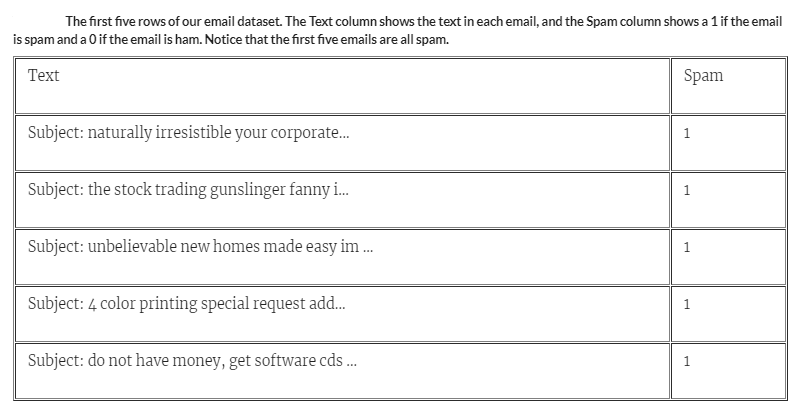
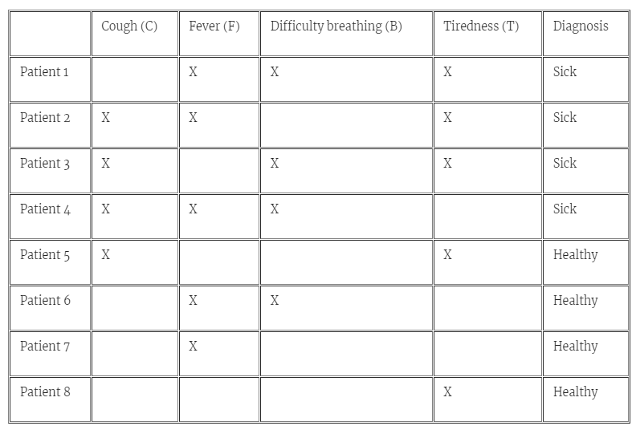

Using probability to its maximum: The naive Bayes model
=====================================================================================================================================================

### In this lab


- calculating conditional probabilities based on events
- using the naive Bayes model to predict whether an email is spam or
    ham, based on the words in the email
- coding the naive Bayes algorithm in Python


Building a spam-detection model with real data
----------------------------------------------

Let's roll up our sleeves and code
the naive Bayes algorithm. Several packages such as Scikit-Learn have
great implementations of this algorithm, and I encourage you to look at
them. However, we'll code it by hand. The dataset we use is from Kaggle,
and for a link to download it, please check the resources for this
lab in appendix C. Here is the code for this section:


- **Notebook**: Coding\_naive\_Bayes.ipynb
    -   <https://github.com/fenago/machine-learning/blob/master/Lab_8_Naive_Bayes/Coding_naive_Bayes.ipynb>
- **Dataset**: emails.csv


For this example, we'll introduce a useful package for handling large
datasets called Pandas (to learn more about it, please check out the
section "Using Pandas to load the dataset" in lab 13). The main
object used to store datasets in pandas is the DataFrame. To load our
data into a Pandas DataFrame, we use the following command:


```
import pandas
emails = pandas.read_csv('emails.csv')
```


In table 8.1, you can see the first five rows of the dataset.


This dataset has two columns. The first column is the text of the email
(together with its subject line), in string format. The second column
tells us if the email is spam (1) or ham (0). First we need to do some
data preprocessing.




#### Data preprocessing


Let's start by turning the text string into a list of words. We do this
using the following function, which uses the `lower()`
function
to turn all the words into lowercase and the `split()`
function
to turn the words into a list. We check only whether each word appears
in the email, regardless of how many times it appears, so we turn it
into a set and then into a list.


```
def process_email(text):
text = text.lower()
return list(set(text.split()))
```


Now we use the apply()
function
to apply this change to the entire column. We call the new column
emails\[\'words\'\].


```
emails['words'] = emails['text'].apply(process_email)
```


The first five rows of the modified email dataset are shown in table
8.2.


#### Finding the priors


Let's
first
find the probability that an email is spam (the prior). For this, we
calculate the number of emails that are spam and divide it by the total
number of emails. Notice that the number of emails that are spam is the
sum of entries in the Spam column. The following line will do the job:


```
sum(emails['spam'])/len(emails)
0.2388268156424581
```


We deduce that the prior probability that the email is spam is around
0.24. This is the probability that an email is spam if we don't know
anything about the email. Likewise, the prior probability that an email
is ham is around 0.76.


#### Finding the posteriors with Bayes' theorem


We
need
to find the probabilities that spam (and ham) emails contain a certain
word. We do this for all words at the same time. The following function
creates a dictionary called model, which records each word, together
with the number of appearances of the word in spam emails and in ham
emails:


```
model = {}

for index, email in emails.iterrows():
    for word in email['words']:
        if word not in model:
            model[word] = {'spam': 1, 'ham': 1}
        if word in model:
            if email['spam']:
                model[word]['spam'] += 1
            else:
                model[word]['ham'] += 1
```


Note that the counts are initialized at 1, so in reality, we are
recording one more appearance of the email as spam and ham. We use this
small hack to avoid having zero counts, because we don't want to
accidentally divide by zero. Now let's examine some rows of the
dictionary as follows:


```
model['lottery']
{'ham': 1, 'spam': 9}

model['sale']
{'ham': 42, 'spam': 39}
```


This means that the word *lottery* appears in 1 ham email and 9 spam
emails, whereas the word *sale* appears in 42 ham emails and 39 spam
emails. Although this dictionary doesn't contain any probabilities,
these can be deduced by dividing the first entry by the sum of both
entries. Thus, if an email contains the word lottery, the probability of
it being spam is , and if it contains the word sale, the probability of it
being spam is .


#### Implementing the naive Bayes algorithm


The
input of the algorithm is the email. It goes through all the words in
the email, and for each word, it calculates the probabilities that a
spam email contains it and that a ham email contains it. These
probabilities are calculated using the dictionary we defined in the
previous section. Then we multiply these probabilities (the naive
assumption) and apply Bayes' theorem to find the probability that an
email is spam given that it contains the words on this particular email.
The code to make a prediction using this model follows:


```
def predict_naive_bayes(email):
    total = len(emails)
    num_spam = sum(emails['spam'])
    num_ham = total - num_spam
    email = email.lower()
    words = set(email.split())
    spams = [1.0]
    hams = [1.0]
    for word in words:
        if word in model:
            spams.append(model[word]['spam']/num_spam*total)
            hams.append(model[word]['ham']/num_ham*total)
    prod_spams = np.long(np.prod(spams)*num_spam)
    prod_hams = np.long(np.prod(hams)*num_ham)
    return prod_spams/(prod_spams + prod_hams)
```


You may note that in the previous code, we used another small hack.
Every probability is multiplied by the total number of emails in the
dataset. This won't affect our calculations because this factor appears
in the numerator and the denominator. However, it does ensure that our
products of probabilities are not too small for Python to handle.


Now that we have built the model, let's test it by making predictions on
some emails as follows:


```
predict_naive_bayes('Hi mom how are you')
0.12554358867163865

predict_naive_bayes('meet me at the lobby of the hotel at nine am')
0.00006964603508395

predict_naive_bayes('buy cheap lottery easy money now')
0.9999734722659664

predict_naive_bayes('asdfgh')
0.2388268156424581
```


It seems to work well. Emails like 'hi mom how are you' get a low
probability (about 0.12) of being spam, and emails like 'buy cheap
lottery easy money now' get a very high probability (over 0.99) of being
spam. Notice that the last email, which doesn't contain any of the words
in the dictionary, gets a probability of 0.2388, which is precisely the
prior.


#### Further work


This was a quick implementation of the naive Bayes algorithm. But for
larger datasets, and larger emails, we should use a package. Packages
like Scikit-Learn offer great implementations of the naive Bayes
algorithm, with many parameters to play with. Explore this and other
packages, and use the naive Bayes algorithm on all types of datasets!


Summary
--------

- Bayes' theorem is a technique widely used in probability,
    statistics, and machine learning.
- Bayes' theorem consists of calculating a posterior probability,
    based on a prior probability and an event.
- The prior probability is a basic calculation of a probability,
    given very little information.
- Bayes' theorem uses the event to make a much better estimate of the
    probability in question.
- The naive Bayes algorithm is used when one wants to combine a prior
    probability together with several events.
- The word *naive* comes from the fact that we are making a naive
    assumption, namely, that the events in question are all
    independent.


Exercises
---------

#### Exercise 8.1


For each pair of events A and B, determine if they are independent or
dependent. For (a) to (d), provide mathematical justification. For (e)
and (f) provide verbal justification.


Throwing three fair coins:


1. A: First one falls on heads. B: Third one falls on tails.
2. A: First one falls on heads. B: There is an odd number of heads
    among the three throws.
    
    Rolling two dice:
    
3. A: First one shows a 1. B: Second one shows a 2.
4. A: First one shows a 3. B: Second one shows a higher value than the
    first one.
    
    For the following, provide a verbal justification. Assume that for
    this problem, we live in a place with seasons.
    
5. A: It's raining outside. B: It's Monday.
6. A: It's raining outside. B: It's June.


#### Exercise 8.2


There is an office where we have to go regularly for some paperwork.
This office has two clerks, Aisha and Beto. We know that Aisha works
there three days a week, and Beto works the other two. However, the
schedules change every week, so we never know which three days Aisha is
there, and which two days Beto is there.


1. If we show up on a random day to the office, what is the
    probability that Aisha is the clerk?
    
    We look from outside and notice that the clerk is wearing a red
    sweater, although we can't tell who the clerk is. We've been going
    to that office a lot, so we know that Beto tends to wear red more
    often than Aisha. In fact, Aisha wears red one day out of three
    (one-third of the time), and Beto wears red one day out of two (half
    of the time).
    
2. What is the probability that Aisha is the clerk, knowing that the
    clerk is wearing red today?


#### Exercise 8.3


The following is a dataset of patients who have tested positive or
negative for COVID-19. Their symptoms are cough (C), fever (F),
difficulty breathing (B), and tiredness (T).




The goal of this exercise is to build a naive Bayes model that predicts
the diagnosis from the symptoms. Use the naive Bayes algorithm to find
the following probabilities:


##### note


For the following questions, the symptoms that are not mentioned are
completely unknown to us. For example, if we know that the patient has a
cough, but nothing is said about their fever, it does not mean the
patient doesn't have a fever.


1. The probability that a patient is sick given that the patient has a
    cough
2. The probability that a patient is sick given that the patient is
    not tired
3. The probability that a patient is sick given that the patient has a
    cough and a fever
4. The probability that a patient is sick given that the patient has a
    cough and a fever, but no difficulty